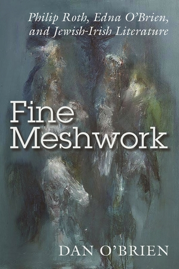

layout: page
title: Publications
permalink: /publications/
---
# Publications

## Books

*Fine Meshwork*

A dual biography of the Irish author Edna O'Brien and her friend the American writer Philip Roth, published by Syracuse University Press. Manuscript awarded the inaugural Irish Research Council Maurice J. Bric Medal for Excellence in the Humanities. 

 [jekyllrb.com](https://jekyllrb.com/)

You can find the source code for Minima at GitHub:
[jekyll][jekyll-organization] /
[minima](https://github.com/jekyll/minima)

You can find the source code for Jekyll at GitHub:
[jekyll][jekyll-organization] /
[jekyll](https://github.com/jekyll/jekyll)

[jekyll-organization]: https://github.com/jekyll